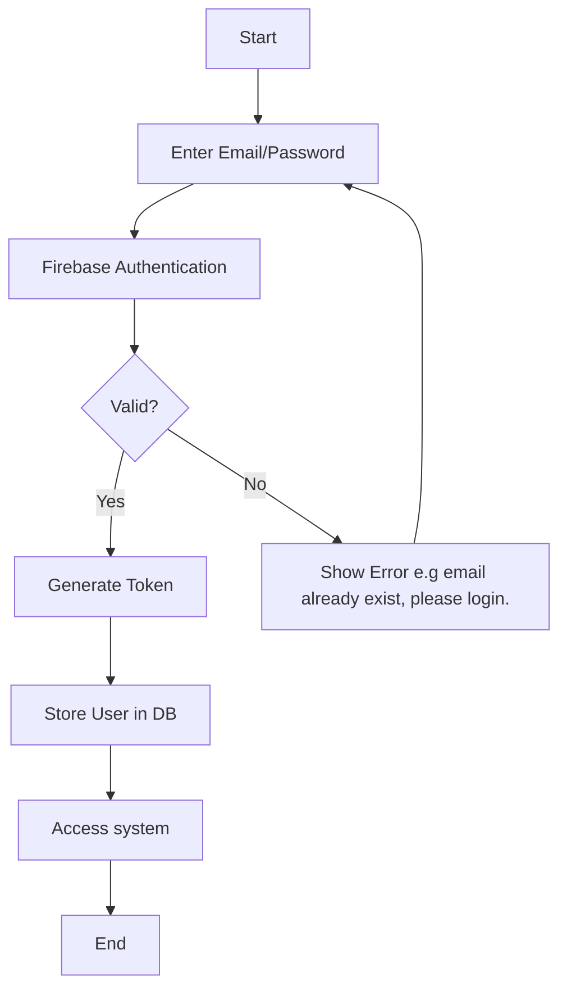
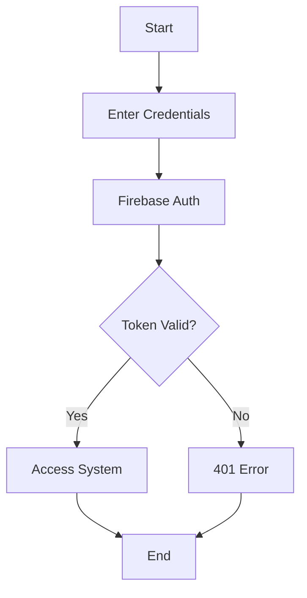
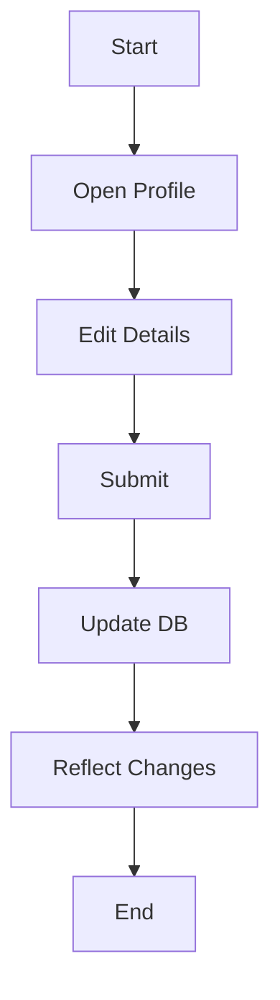
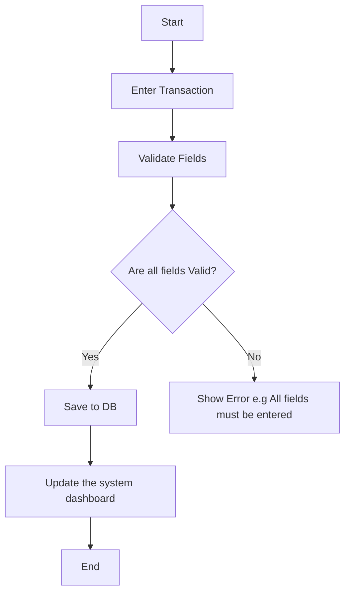
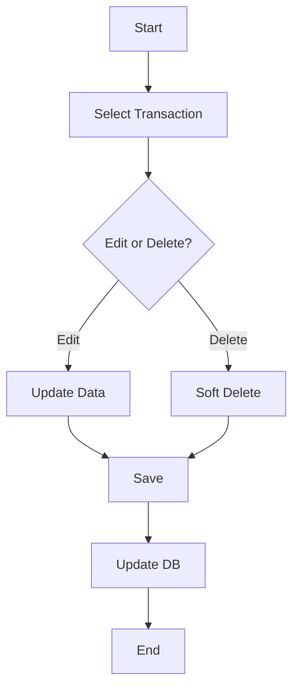
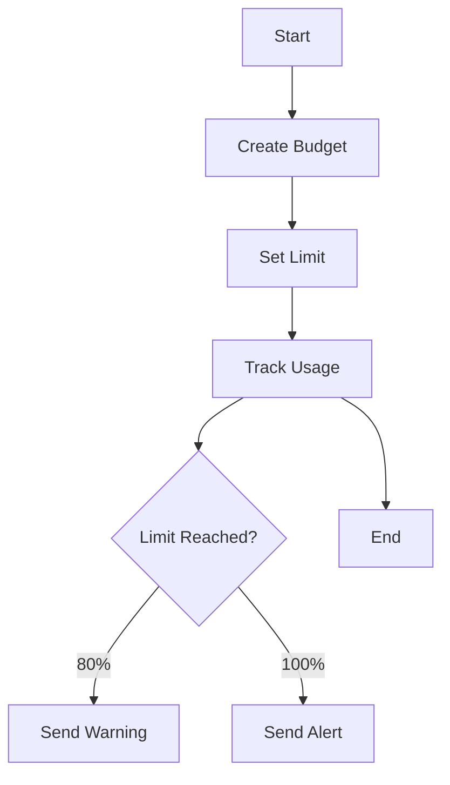
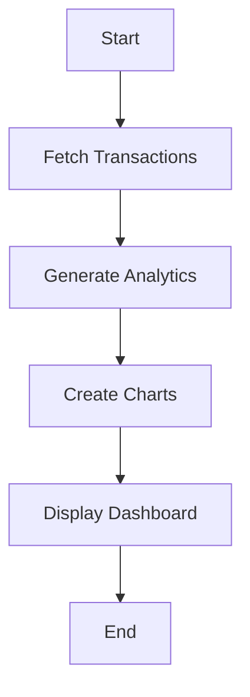
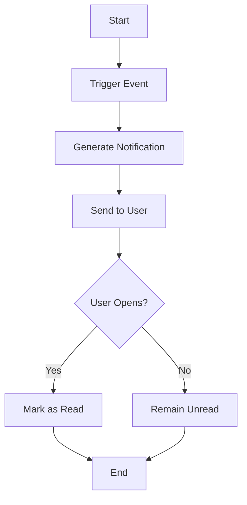

# ZakaWise: Activity Diagrams

## Overview

This document defines activity diagrams for 8 workflows in the ZakaWise Personal Finance Management System. Each diagram uses UML activity diagram conventions (start/end nodes, actions, decisions, parallel actions, and swimlanes) expressed in Mermaid flowchart syntax.

## 1. User registration

## Explaination
- User authentication ensures that a user enters a valid email meeting the user's security requirement.
- User authentication also ensures no one accesses someone else's account improving the system security and reliability

## 2. Login

## Explaination
- User authentication ensures that a user enters a valid email and password meeting the user's security requirement.
- User authentication also ensures only authenticated and authorized users access the system and their accounts.

## 3. Profile management

## Explaination
- Parallel actions ensure profile updates in real time, ensuring the user's scalability requirement
- Proper communication with database ensure concurrent updates on the system and database ensuring reliability of the system.

## 4. Add transaction

## Explaination
- Field validation ensures accurate data is entered by the user which meets the integrity of the analytics report requirement
- Parallel actions ensure the system dashboard is updated in real time, ensuring the user's scalability requirement.

## 5. Edit & Delete transaction

## Explaination
- Data modification enhance data integrity in the system and reports
- Soft delete improves data reliability by storing the deleted data for a period of time on the backend just incase the user needs that data or transaction again.

# 6. Budget

## Explaination
- System alerts in real time ensures reliability on the requirements to realy on the system to alert the user when exceeding the budget

## 7. Analytics report

## Explaination
- AI-powered report generation will ensure the accurate and data oriented analytics report

## 8. Notification

## Explaination
- Real time notofications will ensure reliability of the system by alerting the user whenever there's a change in data or on the system

