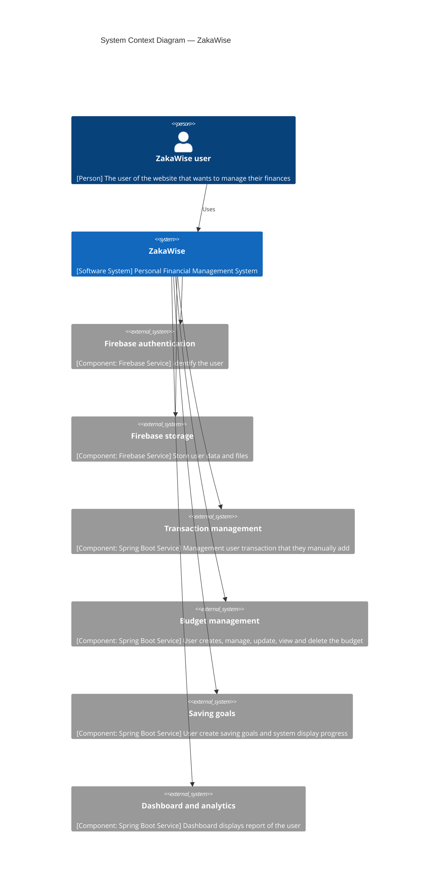
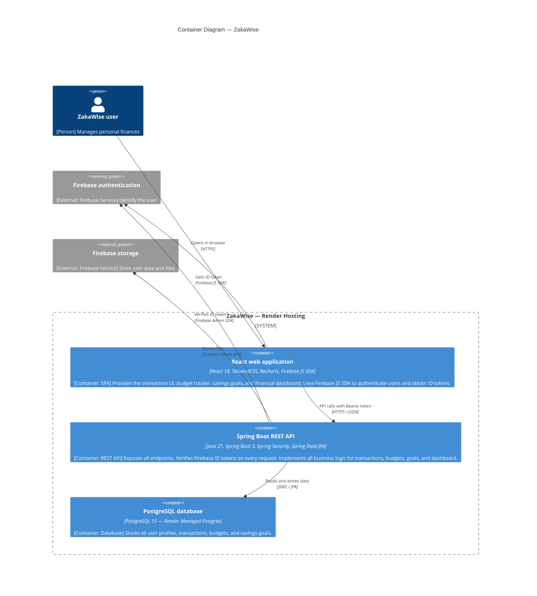
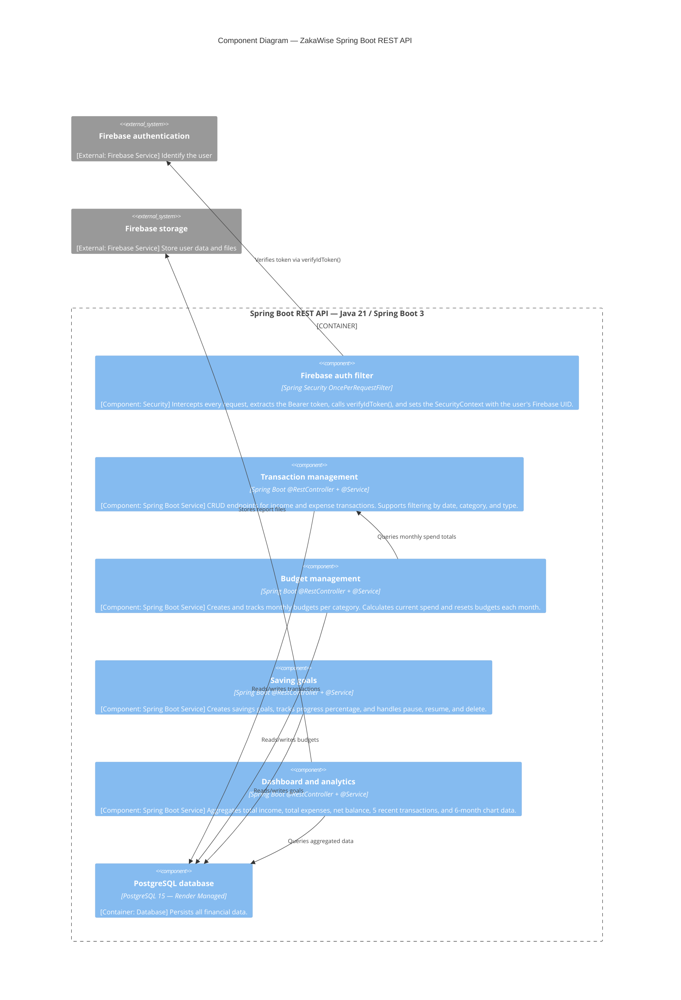
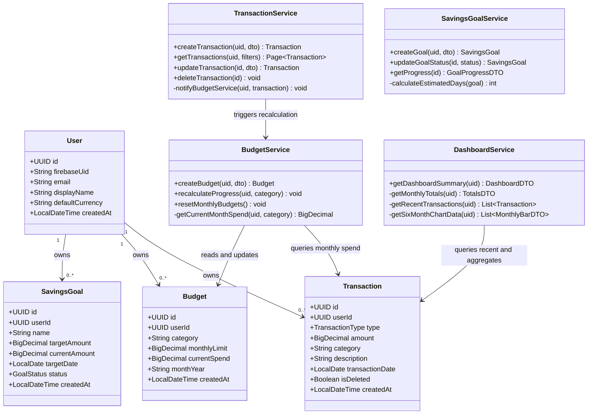
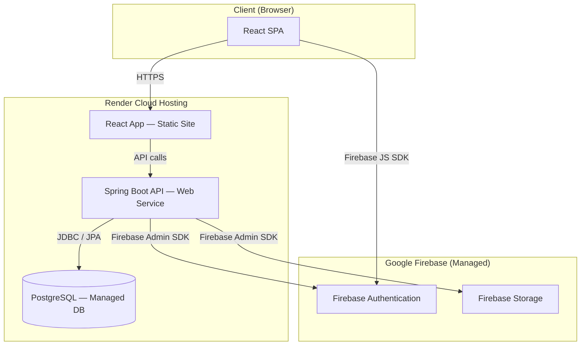

# ARCHITECTURE.md — ZakaWise: Personal Finance Management System

---

## Project Overview

**Project Title**: ZakaWise — Personal Finance Management System
**Domain**: FinTech (Financial Technology)
**Problem Statement**: Many people lack financial management discipline, literacy, and skills. Their finances are spread across different accounts making real-time tracking difficult, they overspend without budget awareness, and they make poor financial decisions without guidance. ZakaWise solves these issues in one unified platform where users can plan, track, and improve their finance management.
**Individual Scope**: Single developer, one semester (~14 weeks). Stack: React (frontend), Java Spring Boot (REST API), PostgreSQL (database), Firebase Authentication (identity). Deployed on Render.

---

## C4 Diagram Overview

The C4 model describes software architecture at four increasing levels of detail:

| Level | Focus |
|---|---|
| **Level 1 — System Context** | Who uses ZakaWise and what external systems does it depend on? |
| **Level 2 — Container** | What are the deployable units that make up the system? |
| **Level 3 — Component** | What are the internal components inside the Spring Boot API? |
| **Level 4 — Code** | Class and entity-level detail for the core domain model |

---

## Level 1 — System Context Diagram

> Shows ZakaWise in relation to its user and all system components it depends on.



---

## Level 2 — Container Diagram

> Shows all deployable containers that make up ZakaWise.



---

## Level 3 — Component Diagram

> Zooms into the Spring Boot API and shows its internal components.



---

## Level 4 — Code Diagram (JPA Entities & Service Layer)

> Class-level view of the core JPA entities and their service relationships.



---

## End-to-End Request Flow — Add a Transaction

> The complete request lifecycle from the React UI through Firebase token verification to PostgreSQL and back.

```mermaid
sequenceDiagram
  actor User
  participant Browser as React Web App
  participant Firebase as Firebase Auth
  participant API as Spring Boot API
  participant Filter as FirebaseAuthFilter
  participant TS as TransactionService
  participant BS as BudgetService
  participant DB as PostgreSQL

  User->>Browser: Fills transaction form, clicks Save
  Browser->>Firebase: getIdToken()
  Firebase-->>Browser: Returns Firebase ID token
  Browser->>API: POST /api/transactions — Authorization: Bearer token
  API->>Filter: Intercepts request
  Filter->>Firebase: verifyIdToken(token)
  Firebase-->>Filter: DecodedToken (uid, email)
  Filter-->>API: SecurityContext set with uid
  API->>TS: createTransaction(uid, dto)
  TS->>DB: transactionRepository.save(transaction)
  DB-->>TS: Persisted Transaction
  TS->>BS: recalculateProgress(uid, category)
  BS->>DB: Sum expense transactions for category and month
  DB-->>BS: Current spend total
  BS->>DB: budgetRepository.save(updatedBudget)
  API-->>Browser: 201 Created
  Browser-->>User: Success toast; dashboard refreshes
```

---

## Deployment Architecture

> ZakaWise is fully deployed on Render.



---

## Technology Mapping Summary

| Concern | Solution |
|---|---|
| User Identity & Login | Firebase Authentication (email/password + Google Sign-In) |
| Frontend | React 18 SPA — TailwindCSS, Recharts |
| API Layer | Java 21 + Spring Boot 3 REST Controllers |
| Token Verification | `FirebaseAuthFilter` + Firebase Admin SDK `verifyIdToken()` |
| Data Persistence | Spring Data JPA (Hibernate) + PostgreSQL 15 |
| Budget Progress | `BudgetService` — sums expense transactions per category per month |
| Dashboard Aggregation | `DashboardService` — totals, recent 5 transactions, 6-month chart |
| Deployment | Render (Static Site + Web Service + Managed PostgreSQL) |
