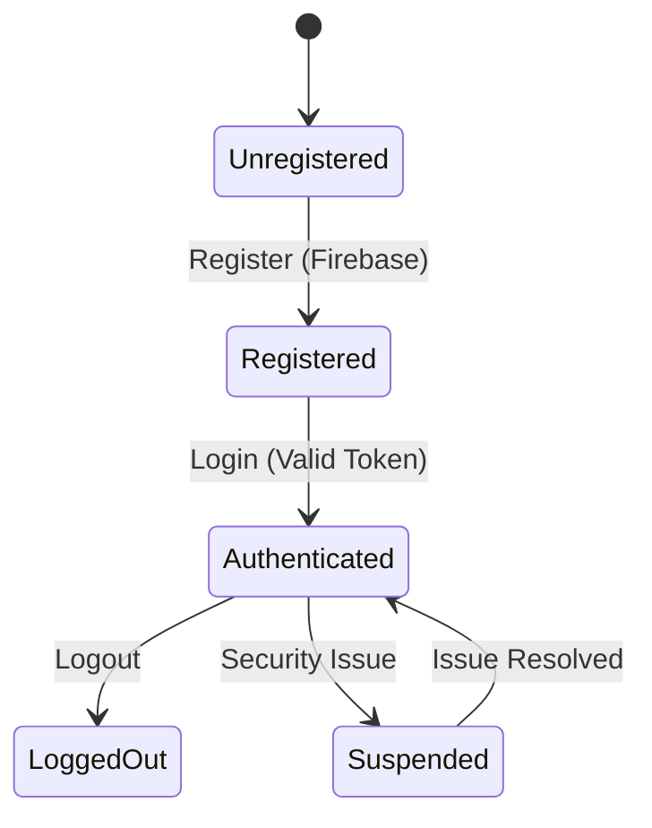
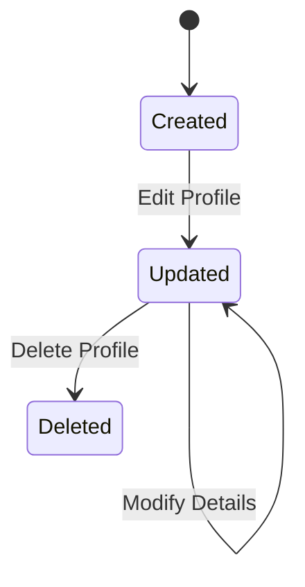
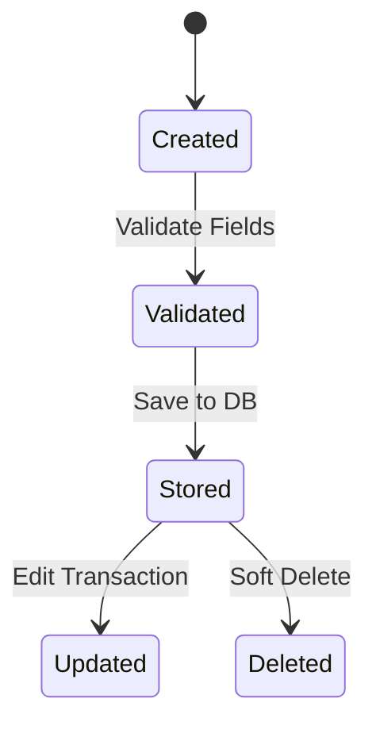
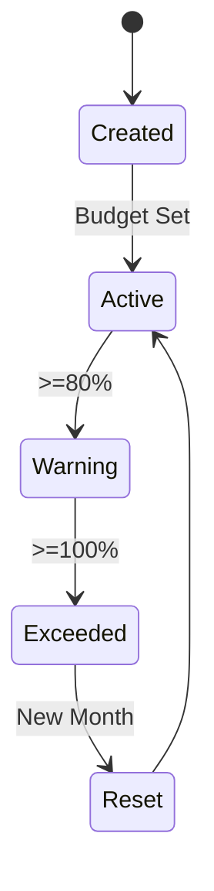
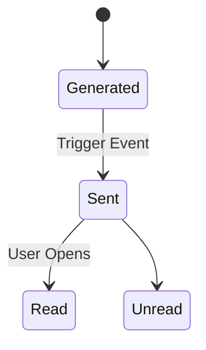
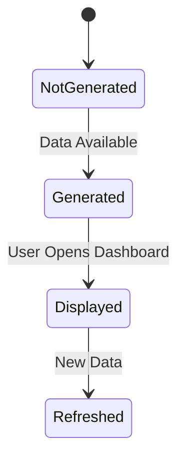
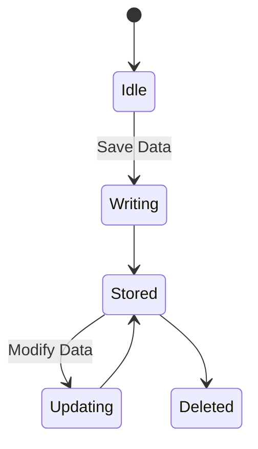

# ZakaWise: State Transition Diagrams

## Overview

This document defines state transition diagrams for 8 critical objects in the ZakaWise Personal Finance Management System. Each diagram follows UML standards and is traced to functional requirements defined in the SRD.

## 1. User Account

## Explanation
- Covers FR-01 (Registration) and FR-02 (Authentication)
- User must enter valid email and password
- Firebase confirm the email and password is valid and doesn't exist in the database
- Firebase confirm the account and the user can login and access the system
- Suspended is when the account exists but access is blocked. The user cannot log in due to technical or maybe entered the wrong password a few times.
- Logout the user exit the system and all the transactions and activities done on the system are saved on PostgresSQL.

## 2. User Profile State

## Explanation
- Covers FR-03
- Editing - The profile form is open and the user is making changes.
- The changes are saved on the database and system and they are displayed on the system
- Delete profile - The user permanetly deleted the account and all the related data in the database

## 3. Transaction

## Explanation
- Covers FR-04 & FR-05
- User add the transaction and Firebase validate all the fields are populated.
- PostgresSQL save the transaction on the database
- User edit the transaction and Postgres save the newly updated transaction
- User delete the transaction but the database marks it deleted but it is temporarily stored in the database for recovery for a certain period of time.

## 4. Budget

## Explanation
- Covers FR-07 & FR-08
- User add the desired budget and saved on the database.
- System alert the user when they are 80% up their budget
- System alert the user when they exceeded their budget
- System reset the budget for a new budget to be drafted by the user.

## 5. Notification

## Explanation
- Covers FR-09
- Generated - A system event (budget 80% alert, new analytics report, app update) has created a notification record.
- Delivered - The notification has been pushed to the user's active session or device.
- Read - The user has opened the notification.
- Unread - The user hasn't open the notification.

## 6. Dashboard

## Explanation
- Covers FR-10
- The system generate the report based on the data available on the system.
- The system displays the report to viewed by the user.

## 7. Database

## Explanation
- Covers FR-12
- User enter data and the system sends it to the database
- Database saves the data
- Database update the data when the user modify the data on the system
- Database remove the data when the user delete the data on the system.
